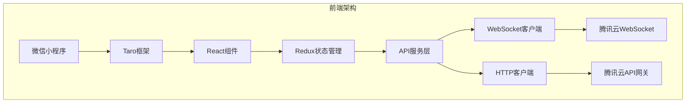
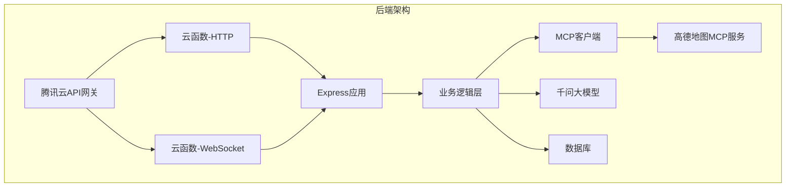
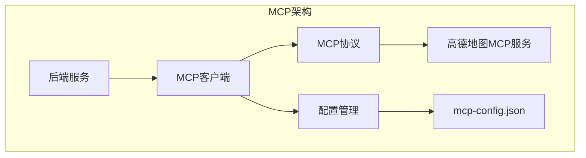
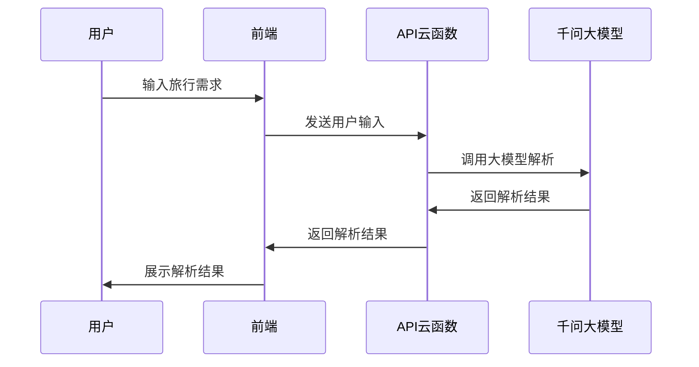
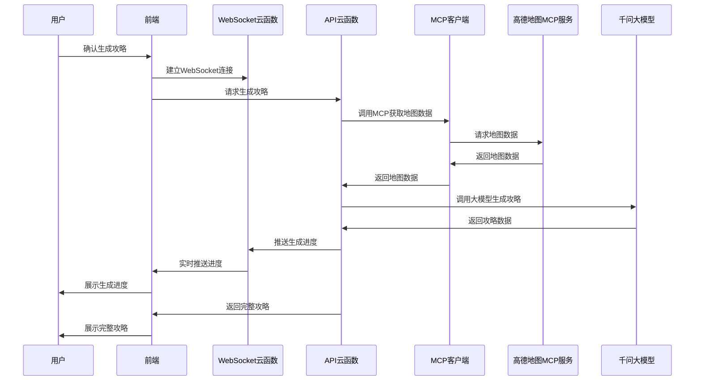
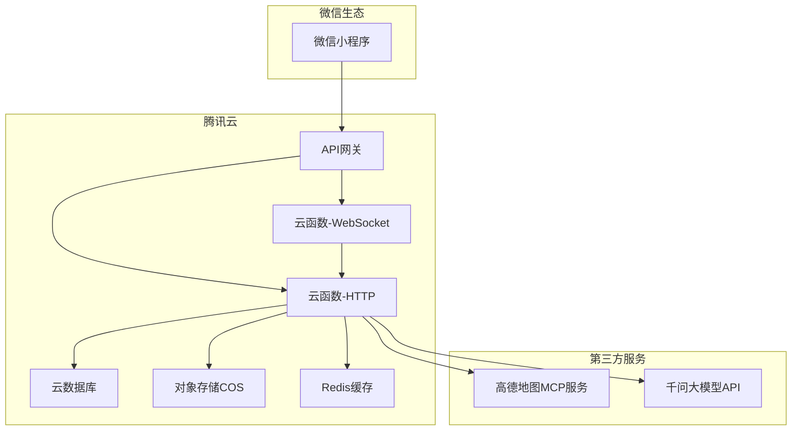
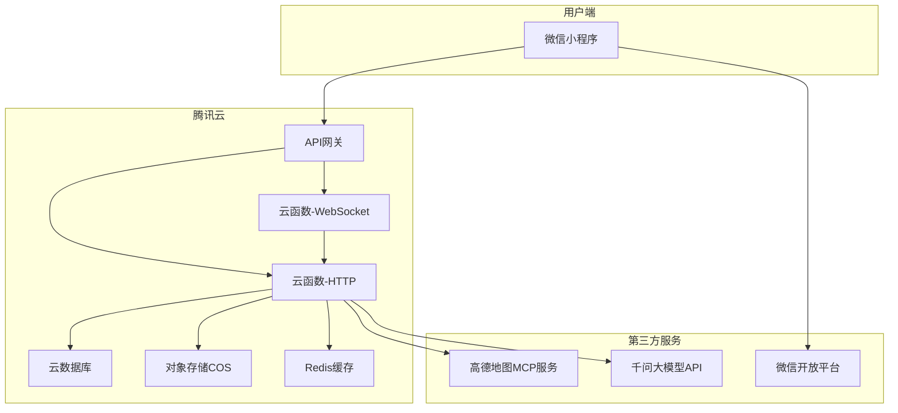
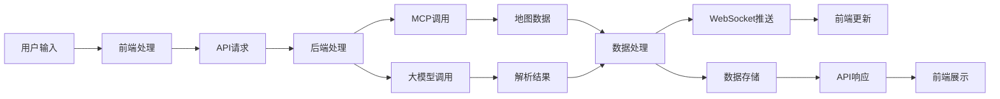

# 旅行攻略微信小程序技术架构设计

## 1. 项目概述

本项目是一个基于高德地图MCP API的旅行攻略微信小程序，用户只需输入旅行需求（如目的地、日期、兴趣偏好等），即可自动生成个性化旅行攻略。系统采用前后端分离架构，前端使用微信小程序技术栈，后端基于腾讯云函数实现，通过MCP协议调用高德地图服务，结合千问大模型提供智能攻略生成能力。

## 2. 技术选型

### 2.1 前端技术栈

| 技术 | 版本 | 选择理由 |
|------|------|----------|
| 微信小程序 | 原生框架 | 符合微信生态，提供原生体验 |
| Taro | 3.x | 支持React语法，组件化开发，可编译成小程序代码 |
| React | 18.x | 成熟的前端框架，生态丰富 |
| TypeScript | 5.x | 提供类型检查，提高代码质量 |
| Redux | 4.x | 状态管理，保证数据流可控 |
| Taro UI | 3.x | 适配小程序的UI组件库 |

### 2.2 后端技术栈

| 技术 | 版本 | 选择理由 |
|------|------|----------|
| Node.js | 20.19 | 性能优秀，生态丰富，与前端技术栈统一 |
| Express | 4.x | 轻量级Web框架，适合云函数环境 |
| TypeScript | 5.x | 提供类型检查，提高代码质量 |
| 腾讯云函数 | - | 无服务器架构，自动扩缩容，降低运维成本 |
| 腾讯云API网关 | - | 统一API入口，提供鉴权和流量控制 |
| 腾讯云数据库 | - | 高可用、可扩展的数据库服务 |
| 腾讯云COS | - | 对象存储服务，用于文件存储 |

### 2.3 第三方服务

| 服务 | 用途 |
|------|------|
| 高德地图MCP Server | 地图服务、路径规划、POI搜索等 |
| 千问大模型API | 自然语言处理，解析用户输入 |
| 微信开放平台 | 用户身份认证，微信登录 |

## 3. 目录结构规范

### 3.1 前端目录结构

```
frontend/
├── src/                    # 源代码目录
│   ├── components/         # 通用组件
│   │   ├── common/         # 公共组件
│   │   ├── map/            # 地图相关组件
│   │   └── travel/         # 旅行相关组件
│   ├── pages/              # 页面组件
│   │   ├── home/           # 首页
│   │   ├── search/         # 搜索页
│   │   ├── guide/          # 攻略页
│   │   └── profile/        # 个人中心
│   ├── utils/              # 工具函数
│   │   ├── request.ts      # 网络请求封装
│   │   ├── websocket.ts    # WebSocket客户端
│   │   └── storage.ts      # 本地存储封装
│   ├── services/           # API服务
│   │   ├── auth.ts         # 认证服务
│   │   ├── travel.ts       # 旅行相关API
│   │   └── map.ts          # 地图相关API
│   ├── store/              # Redux状态管理
│   │   ├── actions/        # Action定义
│   │   ├── reducers/        # Reducer定义
│   │   └── index.ts        # Store配置
│   ├── types/              # TypeScript类型定义
│   │   ├── api.ts          # API类型
│   │   ├── map.ts          # 地图类型
│   │   └── travel.ts       # 旅行类型
│   ├── assets/             # 静态资源
│   │   ├── images/         # 图片资源
│   │   └── styles/         # 样式文件
│   ├── app.config.ts       # 应用配置
│   └── app.ts              # 应用入口
├── config/                 # Taro配置
│   ├── index.js            # 默认配置
│   └── prod.js             # 生产环境配置
├── project.config.json     # 微信小程序配置
├── package.json
└── tsconfig.json
```

### 3.2 后端目录结构

```
backend/
├── src/                    # 源代码目录
│   ├── controllers/        # 控制器
│   │   ├── auth.ts         # 认证控制器
│   │   ├── travel.ts       # 旅行控制器
│   │   └── map.ts          # 地图控制器
│   ├── services/           # 业务逻辑服务
│   │   ├── auth.ts         # 认证服务
│   │   ├── travel.ts       # 旅行服务
│   │   ├── map.ts          # 地图服务
│   │   └── llm.ts          # 大模型服务
│   ├── models/             # 数据模型
│   │   ├── user.ts         # 用户模型
│   │   └── travel.ts       # 旅行模型
│   ├── middleware/         # 中间件
│   │   ├── auth.ts         # 认证中间件
│   │   ├── cors.ts         # 跨域中间件
│   │   └── error.ts        # 错误处理中间件
│   ├── utils/              # 工具函数
│   │   ├── logger.ts       # 日志工具
│   │   ├── response.ts     # 响应封装
│   │   └── validation.ts   # 数据验证
│   ├── config/             # 配置文件
│   │   ├── database.ts     # 数据库配置
│   │   ├── llm.ts          # 大模型配置
│   │   └── mcp.ts          # MCP配置
│   └── mcp/                # MCP Client相关
│       ├── client.ts       # MCP客户端
│       ├── tools.ts        # 工具调用封装
│       └── config.json     # MCP服务器配置
├── functions/              # 云函数入口
│   ├── api/                # API云函数
│   │   ├── auth/           # 认证相关API
│   │   ├── travel/         # 旅行相关API
│   │   └── map/            # 地图相关API
│   └── websocket/          # WebSocket云函数
│       ├── connect/        # 连接处理
│       └── message/        # 消息处理
├── package.json
├── serverless.yml          # 腾讯云函数配置
└── tsconfig.json
```

## 4. 编码规范

### 4.1 命名规范

| 类型 | 命名规范 | 示例 |
|------|----------|------|
| 文件名 | kebab-case | travel-guide.ts |
| 组件名 | PascalCase | TravelGuide |
| 变量名 | camelCase | travelGuide |
| 常量名 | UPPER_SNAKE_CASE | API_BASE_URL |
| 类名 | PascalCase | TravelService |
| 函数名 | camelCase | getTravelGuide |
| 接口名 | PascalCase | ITravelGuide |

### 4.2 代码风格

1. 使用TypeScript进行类型检查，所有函数和变量必须有明确的类型定义
2. 使用ESLint + Prettier进行代码格式化，保持代码风格一致
3. 函数和类必须有JSDoc注释，说明功能、参数和返回值
4. 使用语义化的变量和函数名，避免缩写和拼音
5. 避免使用魔法数字，定义为常量
6. 使用async/await处理异步操作，避免回调地狱

### 4.3 Git提交规范

使用Conventional Commits规范：

```
<type>[optional scope]: <description>

[optional body]

[optional footer(s)]
```

类型说明：
- feat: 新功能
- fix: 修复bug
- docs: 文档更新
- style: 代码格式调整
- refactor: 代码重构
- test: 测试相关
- chore: 构建过程或辅助工具的变动

## 5. 前端架构设计

### 5.1 技术架构



### 5.2 组件架构

采用分层组件架构：

1. **页面组件**：对应小程序页面，负责页面级状态和布局
2. **业务组件**：封装业务逻辑，可复用
3. **通用组件**：无业务逻辑，纯UI组件

### 5.3 状态管理

使用Redux进行全局状态管理：

1. **用户状态**：用户信息、登录状态等
2. **旅行状态**：旅行需求、攻略数据等
3. **地图状态**：地图配置、标记点等
4. **UI状态**：加载状态、弹窗状态等

### 5.4 路由管理

使用Taro的路由管理：

1. **页面路由**：基于页面路径的路由
2. **TabBar路由**：底部导航栏路由
3. **参数传递**：通过URL参数和全局状态传递数据

### 5.5 网络请求

封装统一的网络请求模块：

1. **HTTP请求**：基于微信小程序的wx.request封装
2. **WebSocket**：基于微信小程序的wx.connectSocket封装
3. **请求拦截**：统一处理认证、错误等
4. **响应拦截**：统一处理响应数据、错误等

## 6. 后端架构设计

### 6.1 技术架构



### 6.2 云函数设计

1. **API云函数**：处理HTTP请求，返回JSON响应
   - 认证相关：登录、注册、权限验证
   - 旅行相关：攻略生成、查询、更新
   - 地图相关：地点搜索、路线规划

2. **WebSocket云函数**：处理WebSocket连接和消息推送
   - 连接管理：建立、维护、断开连接
   - 消息推送：实时推送攻略生成进度
   - 消息处理：处理客户端发送的消息

3. **定时任务云函数**：处理定时任务
   - 数据清理：清理过期数据
   - 数据统计：生成统计报表
   - 系统监控：检查系统状态

### 6.3 数据库设计

使用腾讯云数据库，主要表结构：

1. **用户表**：存储用户基本信息
2. **旅行表**：存储旅行需求和攻略
3. **收藏表**：存储用户收藏的攻略
4. **日志表**：存储系统日志

### 6.4 缓存策略

1. **热点数据缓存**：使用腾讯云Redis缓存热点数据
2. **API响应缓存**：缓存不常变化的API响应
3. **静态资源缓存**：使用CDN缓存静态资源

## 7. MCP Client设计

### 7.1 MCP架构



### 7.2 MCP客户端实现

1. **连接管理**：建立和管理与MCP服务器的连接
2. **工具调用**：封装MCP工具调用，提供友好的API
3. **错误处理**：统一处理MCP调用错误
4. **结果缓存**：缓存MCP调用结果，减少重复请求

### 7.3 MCP配置

使用标准MCP配置文件格式：

```json
{
  "mcpServers": {
    "amap-maps-streamableHTTP": {
      "url": "https://mcp.amap.com/sse?key=xxxx"
    }
  }
}
```

### 7.4 工具调用封装

封装高德地图MCP工具调用：

1. **地理编码**：地址转经纬度
2. **逆地理编码**：经纬度转地址
3. **POI搜索**：搜索兴趣点
4. **路径规划**：计算最优路线
5. **天气查询**：获取天气信息

## 8. 数据流设计

### 8.1 用户输入流程



### 8.2 攻略生成流程



### 8.3 数据流向

1. **用户输入**：前端收集用户输入，发送到后端
2. **数据处理**：后端解析用户输入，调用MCP和大模型服务
3. **数据存储**：处理结果存储到数据库
4. **数据展示**：前端从后端获取数据，展示给用户

## 9. 部署架构

### 9.1 云端部署架构



### 9.2 部署流程

1. **前端部署**：
   - 使用Taro CLI构建小程序代码
   - 通过微信开发者工具上传代码
   - 在微信公众平台提交审核
   - 审核通过后发布上线

2. **后端部署**：
   - 使用Serverless Framework部署云函数
   - 配置API网关路由和触发器
   - 配置数据库和缓存
   - 配置环境变量和密钥

3. **监控部署**：
   - 配置云监控服务
   - 设置告警规则
   - 配置日志收集

## 10. 安全设计

### 10.1 身份认证

1. **微信登录**：基于微信开放平台的OAuth2.0认证
2. **会话管理**：使用JWT管理用户会话
3. **权限控制**：基于角色的访问控制(RBAC)

### 10.2 数据安全

1. **传输加密**：所有API请求使用HTTPS加密
2. **数据脱敏**：敏感数据脱敏存储
3. **访问控制**：数据库访问权限控制

### 10.3 API安全

1. **请求鉴权**：API网关统一鉴权
2. **流量控制**：API请求频率限制
3. **输入验证**：严格验证输入参数

### 10.4 服务器安全

1. **网络隔离**：使用VPC隔离网络环境
2. **安全组**：配置安全组规则
3. **漏洞扫描**：定期进行安全漏洞扫描

## 11. 监控与运维

### 11.1 监控体系

1. **系统监控**：
   - 云函数性能监控
   - 数据库性能监控
   - 网络监控

2. **业务监控**：
   - API响应时间
   - 错误率
   - 用户活跃度

3. **日志监控**：
   - 错误日志告警
   - 访问日志分析
   - 审计日志记录

### 11.2 告警机制

1. **实时告警**：关键指标异常实时告警
2. **多渠道通知**：短信、邮件、微信通知
3. **告警升级**：严重问题自动升级

### 11.3 运维流程

1. **发布流程**：灰度发布、蓝绿部署
2. **回滚机制**：快速回滚机制
3. **应急预案**：故障应急预案

## 12. 架构图

### 12.1 系统整体架构图



### 12.2 数据流架构图



## 13. 性能优化

### 13.1 前端优化

1. **代码分包**：按页面分包加载，减少首屏加载时间
2. **图片优化**：压缩图片，使用WebP格式
3. **缓存策略**：合理使用本地缓存
4. **懒加载**：非关键资源懒加载

### 13.2 后端优化

1. **数据库优化**：合理设计索引，优化查询
2. **缓存优化**：热点数据缓存，减少数据库压力
3. **并发控制**：合理控制并发请求数
4. **资源复用**：复用数据库连接，减少连接开销

### 13.3 网络优化

1. **CDN加速**：使用CDN加速静态资源
2. **HTTP/2**：使用HTTP/2提高传输效率
3. **压缩传输**：启用Gzip压缩
4. **减少请求**：合并请求，减少请求数量

## 14. 扩展性设计

### 14.1 水平扩展

1. **云函数自动扩缩容**：根据请求量自动调整实例数量
2. **数据库读写分离**：读写分离，提高数据库性能
3. **缓存集群**：使用Redis集群提高缓存性能

### 14.2 功能扩展

1. **插件化架构**：核心功能插件化，便于扩展
2. **模块化设计**：功能模块化，降低耦合度
3. **配置驱动**：通过配置文件控制功能开关

## 15. 风险评估与应对

### 15.1 技术风险

| 风险 | 影响 | 概率 | 应对措施 |
|------|------|------|----------|
| 第三方服务不可用 | 高 | 中 | 实现降级方案，缓存关键数据 |
| 云函数冷启动 | 中 | 高 | 预留实例，保持函数热度 |
| 数据库性能瓶颈 | 高 | 中 | 读写分离，分库分表 |

### 15.2 业务风险

| 风险 | 影响 | 概率 | 应对措施 |
|------|------|------|----------|
| 用户量激增 | 中 | 中 | 自动扩缩容，限流措施 |
| 数据泄露 | 高 | 低 | 数据加密，访问控制 |
| 恶意攻击 | 高 | 中 | 安全防护，流量监控 |

## 16. 总结

本技术架构设计基于微信小程序和腾讯云函数，采用前后端分离架构，通过MCP协议调用高德地图服务，结合千问大模型提供智能攻略生成能力。架构设计考虑了性能、安全、可扩展性等因素，为项目的长期发展奠定了坚实基础。

在实施过程中，需要严格按照架构设计进行开发，确保代码质量和系统稳定性。同时，需要持续监控系统运行情况，及时发现和解决问题，不断优化系统性能。