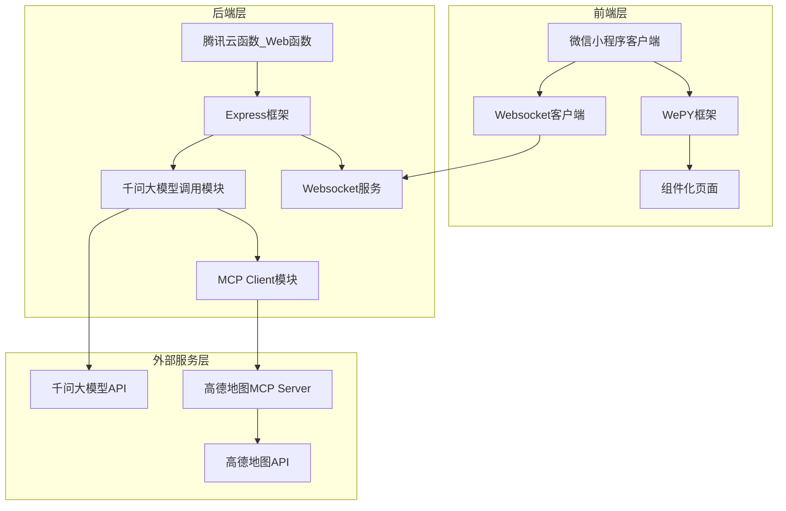
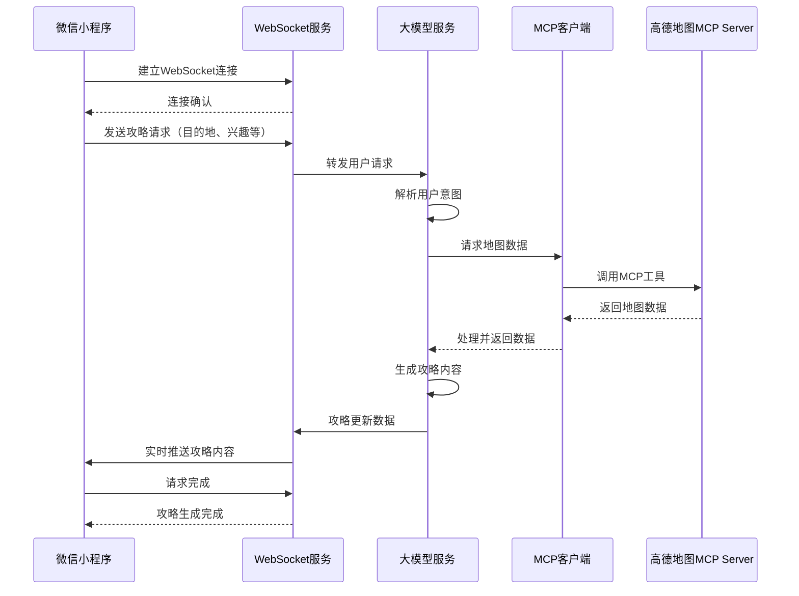
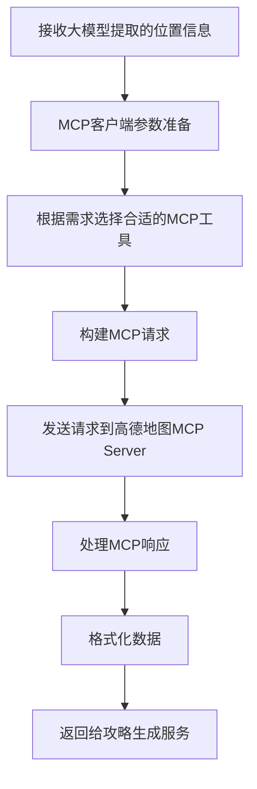

# 旅游指南微信小程序技术架构设计文档

## 1. 项目概述

本项目是一个基于微信小程序的旅游指南应用，旨在为用户提供智能、个性化的旅游攻略服务。应用通过千问大模型解析用户提示词，调用高德地图MCP Server获取地理位置相关数据，并通过Websocket实时返回攻略内容给用户。

## 2. 技术栈选型

### 2.1 前端技术栈

| 技术/框架 | 版本 | 选型理由 |
|---------|------|--------|
| WePY | ^2.0.0 | 基于Vue.js语法的微信小程序框架，开发效率高，支持组件化、TypeScript、Promise等现代JavaScript特性 |
| TypeScript | ^5.0.0 | 提供静态类型检查，增强代码可维护性和可读性 |
| SCSS | ^1.50.0 | 增强CSS能力，支持变量、嵌套、混合等特性，提高样式代码复用性 |
| 微信小程序API | 最新版 | 提供基础功能支持，如网络请求、存储、用户授权等 |

### 2.2 后端技术栈

| 技术/框架 | 版本 | 选型理由 |
|---------|------|--------|
| Node.js | 20.19.0 | 轻量级JavaScript运行环境，生态丰富，适合构建高并发后端服务 |
| Express | ^4.18.0 | 成熟稳定的Node.js Web框架，轻量级，性能优异，中间件丰富 |
| 腾讯云函数(Web函数) | 最新版 | 无需维护服务器，按需付费，支持Websocket，适合部署小型应用 |
| TypeScript | ^5.0.0 | 提供静态类型检查，增强代码可维护性 |
| Socket.IO | ^4.6.0 | 提供跨浏览器的实时双向通信能力，简化Websocket开发 |
| OpenAI SDK | ^4.0.0 | 用于调用千问大模型API，解析用户提示词 |
| MCP SDK | 最新版 | 用于调用高德地图MCP Server |

## 3. 系统架构

### 3.1 整体架构图



### 3.2 目录结构规范

#### 3.2.1 前端目录结构

```plaintext
frontend/
├── src/                     # 源代码目录
│   ├── components/          # 公共组件
│   │   ├── map/             # 地图相关组件
│   │   ├── guide/           # 攻略相关组件
│   │   └── common/          # 通用组件
│   ├── pages/               # 页面文件
│   │   ├── index/           # 首页
│   │   ├── guide-detail/    # 攻略详情页
│   │   ├── search/          # 搜索页
│   │   └── user/            # 用户中心
│   ├── services/            # 服务层
│   │   ├── api.ts           # API接口定义
│   │   ├── websocket.ts     # WebSocket连接管理
│   │   └── storage.ts       # 本地存储服务
│   ├── utils/               # 工具函数
│   ├── assets/              # 静态资源
│   │   ├── images/          # 图片资源
│   │   └── styles/          # 全局样式
│   ├── app.ts               # 小程序入口文件
│   ├── app.scss             # 全局样式文件
│   └── app.config.ts        # 小程序配置文件
├── typings/                 # TypeScript类型定义
├── project.config.json      # 项目配置文件
├── tsconfig.json            # TypeScript配置
├── package.json             # 项目依赖配置
└── .eslintrc.js             # ESLint配置
```

#### 3.2.2 后端目录结构

```plaintext
backend/
├── src/                     # 源代码目录
│   ├── controllers/         # 控制器
│   │   ├── guideController.ts   # 攻略相关接口
│   │   └── websocketController.ts # WebSocket控制器
│   ├── services/            # 服务层
│   │   ├── modelService.ts     # 大模型服务
│   │   ├── mcpService.ts       # MCP服务
│   │   └── guideService.ts     # 攻略生成服务
│   ├── utils/               # 工具函数
│   │   ├── logger.ts          # 日志工具
│   │   └── response.ts        # 响应格式化工具
│   ├── config/              # 配置文件
│   │   ├── index.ts           # 配置入口
│   │   ├── mcpConfig.ts       # MCP配置
│   │   └── modelConfig.ts     # 模型配置
│   ├── mcp/                 # MCP客户端实现
│   │   ├── client.ts          # MCP客户端
│   │   └── types.ts           # MCP相关类型定义
│   ├── middlewares/         # 中间件
│   │   ├── cors.ts            # CORS中间件
│   │   └── errorHandler.ts    # 错误处理中间件
│   ├── app.ts               # Express应用入口
│   └── server.ts            # 服务器启动文件
├── .env.example             # 环境变量示例文件
├── package.json             # 项目依赖配置
├── tsconfig.json            # TypeScript配置
├── serverless.yml           # 云函数配置文件
└── README.md                # 后端服务说明文档
```

## 4. 编码规范

### 4.1 命名规范

#### 4.1.1 前端命名规范

| 项目 | 规范 | 示例 |
|------|------|------|
| 变量名 | 小驼峰命名法 | `userName`, `isGuideLoaded` |
| 常量名 | 大驼峰命名法 | `MaxGuideLength`, `DefaultCity` |
| 函数名 | 小驼峰命名法 | `getGuideData()`, `formatDate()` |
| 组件名 | 大驼峰命名法 | `GuideCard.vue`, `MapContainer.vue` |
| 文件名 | 小写字母，单词间用连字符 | `guide-detail.ts`, `user-service.ts` |
| CSS类名 | BEM命名法 | `guide-card__title--active` |

#### 4.1.2 后端命名规范

| 项目 | 规范 | 示例 |
|------|------|------|
| 变量名 | 小驼峰命名法 | `requestBody`, `responseData` |
| 常量名 | 全大写，单词间用下划线 | `MAX_TOKEN_SIZE`, `API_TIMEOUT` |
| 函数名 | 小驼峰命名法 | `generateGuide()`, `validateRequest()` |
| 类名 | 大驼峰命名法 | `McpClient`, `ModelService` |
| 文件名 | 小写字母，单词间用连字符 | `guide-controller.ts`, `websocket-service.ts` |
| 目录名 | 小写字母，单词间用连字符 | `controllers`, `middlewares` |

### 4.2 代码格式规范

#### 4.2.1 TypeScript代码规范

- 使用空格进行缩进，4个空格
- 行尾必须有分号
- 字符串使用单引号
- 接口和类型使用大驼峰命名法，接口前缀为`I`
- 类型定义文件使用`.ts`扩展名
- 每行最多100个字符
- 花括号在同一行开始，在内容下方另起一行结束
- 函数参数逗号后必须有空格
- if/else语句必须使用花括号

#### 4.2.2 注释规范

- 文件头部必须包含版权信息和文件功能描述
- 函数和类必须包含JSDoc格式注释，说明功能、参数和返回值
- 复杂逻辑必须有行内注释
- 接口和类型定义必须有注释说明用途
- 配置项必须有注释说明含义和取值范围

## 5. 核心功能模块设计

### 5.1 前端模块设计

#### 5.1.1 首页模块
- 展示热门旅游目的地
- 提供搜索功能
- 显示用户历史攻略
- 提供新建攻略入口

#### 5.1.2 攻略搜索模块
- 支持关键词搜索
- 支持地点筛选
- 实时搜索建议
- 搜索历史记录

#### 5.1.3 攻略详情模块
- 展示攻略内容
- 集成地图展示
- 提供收藏和分享功能
- 支持用户评价

#### 5.1.4 WebSocket通信模块
- 建立和维护WebSocket连接
- 发送攻略生成请求
- 接收实时更新的攻略内容
- 错误处理和重连机制

### 5.2 后端模块设计

#### 5.2.1 云函数入口模块
- 初始化Express应用
- 配置中间件
- 注册路由
- 启动WebSocket服务

#### 5.2.2 大模型服务模块
- 调用千问大模型API
- 处理用户提示词
- 提取关键信息（地点、时间、兴趣点等）
- 返回模型解析结果

#### 5.2.3 MCP客户端模块
- 实现标准MCP协议
- 连接高德地图MCP Server
- 封装工具调用方法
- 处理响应结果

#### 5.2.4 攻略生成服务模块
- 整合大模型解析结果和地图数据
- 生成结构化攻略内容
- 通过WebSocket实时推送更新

## 6. 数据流和交互流程

### 6.1 攻略生成数据流



### 6.2 MCP调用流程



## 7. MCP客户端设计

### 7.1 MCP配置文件

```json
{
  "mcpServers": {
    "amap-maps-streamableHTTP": {
      "url": "https://mcp.amap.com/sse?key=YOUR_API_KEY"
    }
  }
}
```

### 7.2 MCP客户端功能

- 连接和维护MCP Server连接
- 支持标准MCP协议的工具调用
- 处理MCP响应
- 错误处理和重试机制
- 支持流式响应处理

### 7.3 工具调用封装

支持调用高德地图MCP Server提供的以下工具：
1. **步行路径规划 (maps_direction_walking)**：获取步行导航路线
2. **驾车路径规划 (maps_direction_driving)**：获取驾车导航路线
3. **骑行路径规划 (maps_direction_bicycling)**：获取骑行导航路线
4. **地理编码 (maps_geo)**：将地址转换为经纬度坐标
5. **逆地理编码 (maps_regeocode)**：将经纬度坐标转换为地址
6. **周边搜索 (maps_around_search)**：搜索指定位置周边的POI
7. **文本搜索 (maps_text_search)**：根据关键词搜索POI
8. **POI详情查询 (maps_search_detail)**：根据POI ID查询详细信息
9. **公共交通路径规划 (maps_direction_transit_integrated)**：获取公共交通换乘方案
10. **距离计算 (maps_distance)**：计算两点之间的距离
11. **IP定位 (maps_ip_location)**：根据IP地址定位位置
12. **地图展示 (maps_schema_personal_map)**：创建行程规划地图链接
13. **导航 (maps_schema_navi)**：创建导航链接
14. **打车 (maps_schema_take_taxi)**：创建打车链接
15. **天气查询 (maps_weather)**：获取指定城市的天气信息

## 8. 部署架构

### 8.1 前端部署
- 使用微信开发者工具构建并上传
- 微信小程序平台审核发布

### 8.2 后端部署
- 腾讯云函数(Web函数)部署
- 环境变量配置
- 依赖包管理

## 9. 性能优化考虑

- WebSocket连接复用
- 数据缓存机制
- 增量更新攻略内容
- 图片懒加载
- 地图资源按需加载

## 10. 安全考虑

- API密钥安全存储
- 请求参数验证
- 输入内容过滤
- 用户权限控制
- 数据传输加密

## 11. 技术架构总结

本技术架构设计采用了前后端分离的架构模式，前端使用WePY框架开发微信小程序，后端使用腾讯云函数和Express框架提供服务。系统通过WebSocket实现实时数据传输，通过MCP协议调用高德地图API获取地理位置数据，通过千问大模型解析用户意图并生成个性化攻略。

整体架构清晰，组件化程度高，易于维护和扩展。通过腾讯云函数的无服务器架构，降低了运维成本，提高了系统的可扩展性和弹性。